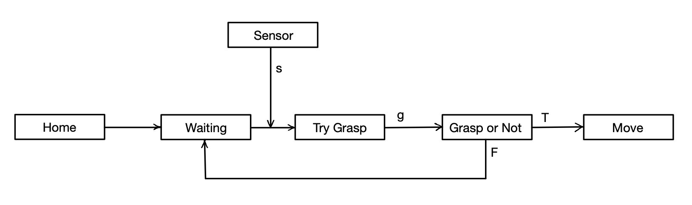

# ECE470ProjectBasketballShoot
Group members：Yiqun Niu, Zhenyu Zong, Xiang Li

## **UPDATE 2** 
[video](https://www.youtube.com/watch?v=oTiXtuupihU&feature=youtu.be)

### **Methods**

- Download the V-rep and run it with

```
    $ ./vrep .sh
```
- Choose ```UR3.ttm``` and ```Jaco hand.ttm``` models from Model browser, connect them with Assemble / Disassemble icon. The scene is saved as ```Update2Scene.tttt``` file.

- Delete default child script from the robot because we will run the script with outside python code.

- Make sure the documents ```vrep.py```, ```vrepConst.py``` and ```remoteApi.dylib``` are in the path:

```
V-REP_PRO_EDU_V3_6_2_Mac/programming/remoteApiBindings/python/python
```

- The script code is in the file ```example.py```. This file is based on the codes of the example given by ece470_vrep_Linux.

### **Script Codes**

- Make a martix of the position, which is the angle of every joint. 
```
Goal_joint_angles = np.array([[0,0.5*np.pi,-0.5*np.pi,0.5*np.pi,-0.5*np.pi,np.pi], \
				[-0.5*np.pi,0,-0.5*np.pi,0,0.5*np.pi,-0.5*np.pi],\
				[0.5*np.pi,-0.5*np.pi,-0.5*np.pi,0,0,-0.5*np.pi]])
```
- Then use SetJointPosition function to move the UR3 in simulator. The SetJointPosition function is 
formed by simxSetJointTargetPosition function, which can move only one joint in a particular angle
SetJointPosition function call simxSetJointTargetPosition function 6 time for the 6 joints. The three calls
set the six joints for three times.
```
for i in range(3):
	SetJointPosition(Goal_joint_angles[i])
	time.sleep(2)
```

## **UPDATE 3** 
[video](https://youtu.be/Z8ZXQPDpTU8)

### **Forward Kinematics**

- The script code is in the file ```update3.py```. Run the code in a terminal with the Vrep simulator open, the arm will initialize its position and take commands from the user. The user should type in six angles in degrees which be added to the current angle to move the UR3 arm. You have at most ten chances to try to move the arm. The transform matrix from the home position to the new position will be printed on the screen, which demostrates forward kinematics.

### **JacoHand Gripper**

- The hand is based on child script. In JacoHand's child script file, we need to do some changes for enabling the hand to open and close. Codes are referenced from this [website](http://www.forum.coppeliarobotics.com/viewtopic.php?f=9&t=1891#p8135).

```
sig=sim.getStringSignal('jacoHand')
if sig~=nil then
simClearStringSignal('jacoHand')
if sig=='true' then closing=true else closing=false end
end
```

- Then enable the ```JacoHand``` to grasp and release things. In ```update3.py``` file ```JacoHandGrasp``` function, send the command to ```JacoHand``` with codes:

```
vrep.simxSetStringSignal(clientID,'jacoHand','true',vrep.simx_opmode_oneshot)
vrep.simxSetStringSignal(clientID,'jacoHand','false',vrep.simx_opmode_oneshot)
```

- These instructions can open and close the hand.

## **UPDATE 4** 
[video](https://www.youtube.com/watch?v=3XP7kCzX49o)


### **Decision making**

- Add one Cylinder Item ```cynlinder0``` in the scene. Change the properties of the iteam to make it detectable: In its ```Scene Object Properties``` window, click ```common``` and enable ```Dectable```.

- The robot keeps waiting if nothing is passed to the Jacohand. If no item detected, send back response ```No items, wait!``` and wait. Otherwise, JacoHand will grasp the item and move it to the destination.



### **Perception**

- Robot needs to detect whether there is available items for graspoing. Use ```Proximity Sensor``` to sense the item. First, add a cone proximity sensor to the ```Jacohand```. Then set the ```Scene Object Properties```. The sensor should sense ```all dectectable objects in the scene```. Modify the scan range to make it suitable by clicking ```Show volume parameters```.

- Enable the sensor in codes. Write a new function ```JacoHandHasItem``` to check whether the proximity sensor dectect yhe item or not. Proximity sensor needs to be run twice: Run with ```simx_opmode_streaming``` mode first time and ```simx_opmode_buffer``` second time. ```time.sleep(1)``` must be added, or two instructions will be done at the same time, resulting the dection fail. ```State``` indicate whether the item is sensed. Idea comes from [this website](https://blog.csdn.net/qq_29945727/article/details/98469621), which tells us how to use vision sensor.

```
ret, state, arr1, value, arr2 = vrep.simxReadProximitySensor(clientID, proximity_sensor_handle, vrep.simx_opmode_streaming)
time.sleep(0.1)
ret, state, arr1, value, arr2 = vrep.simxReadProximitySensor(clientID, proximity_sensor_handle, vrep.simx_opmode_buffer)
```
