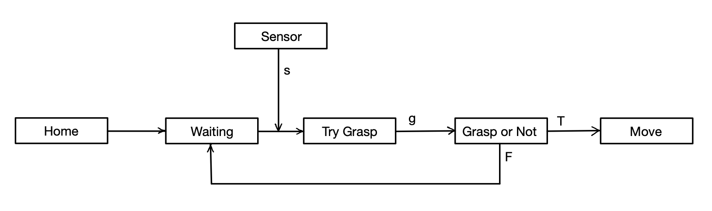

# ECE470ProjectBasketballShoot
Group members：Yiqun Niu, Zhenyu Zong, Xiang Li

This is update 4 for ECE 470 project.

## **1 Introduction**

Task：Demonstrate robot motion with integration of some decision making, planning, and perception. The robot will keep waiting until the player to pass item to it. We will make the robot throw the item in the future.

## **2 Methods**

- Make sure the documents ```vrep.py```, ```vrepConst.py``` and ```remoteApi.dll```(remoteApi.all for Window, for Mac users use ```remoteApi.dylib```) are in the path:

```
vrep_folder/programming/remoteApiBindings/
```

- The script code is in the file ```update4.py```. Run the code in a terminal with the Vrep simulator open.

### 2.1 Decision making

- Add one Cylinder Item ```cynlinder0``` in the scene. Change the properties of the iteam to make it detectable: In its ```Scene Object Properties``` window, click ```common``` and enable ```Dectable```.

- The robot keeps waiting if nothing is passed to the Jacohand. If no item detected, send back response ```No items, wait!``` and wait. Otherwise, JacoHand will grasp the item and move it to the destination.



### 2.2 Perception

- Robot needs to detect whether there is available items for graspoing. Use ```Proximity Sensor``` to sense the item. First, add a cone proximity sensor to the ```Jacohand```. Then set the ```Scene Object Properties```. The sensor should sense ```all dectectable objects in the scene```. Modify the scan range to make it suitable by click ```Show volume parameters```.

- Enable the sensor in codes. Write a new function ```JacoHandHasItem``` to check whether the proximity sensor dectect yhe item or not. Proximity sensor needs to be run twice: Run with ```simx_opmode_streaming``` mode first time and ```simx_opmode_buffer``` second time. ```time.sleep(1)``` must be added, or two instructions will be done at the same time, resulting the dection fail. ```State``` indicate whether the item is sensed. Idea comes from [this website](https://blog.csdn.net/qq_29945727/article/details/98469621), which tells us how to use vision sensor.

```
ret, state, arr1, value, arr2 = vrep.simxReadProximitySensor(clientID, proximity_sensor_handle, vrep.simx_opmode_streaming)
time.sleep(0.1)
ret, state, arr1, value, arr2 = vrep.simxReadProximitySensor(clientID, proximity_sensor_handle, vrep.simx_opmode_buffer)
```

## 3 Video 
Video can be found [here](https://www.youtube.com/watch?v=3XP7kCzX49o). 
